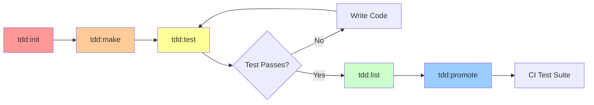

# Laravel TDDraft

<div align="center">
  
  <p><strong>Set up Test-Driven Development environments in Laravel using Pest 3 with dedicated draft testing directories.</strong></p>

  [](https://packagist.org/packages/grazulex/laravel-tddraft)
  [](https://packagist.org/packages/grazulex/laravel-tddraft)
  [](LICENSE.md)
  [](https://php.net)
  [](https://laravel.com)
  [](https://pestphp.com)
  [](https://github.com/laravel/pint)
</div>

## Overview

**Laravel TDDraft** helps you practice Test-Driven Development by providing a structured approach to draft testing in Laravel applications. It creates a separate testing environment for experimental tests that won't interfere with your main test suite or CI pipeline.

### TDDraft → CI Workflow

<div align="center">
  
  <p><em>Visual representation of the TDDraft workflow and promotion to CI test suite</em></p>
</div>

The package enables a clean separation between experimental draft tests and production-ready CI tests, allowing you to practice TDD without affecting your deployment pipeline.

## ✨ Features

- 🔧 **Five-command TDD workflow**: The core innovation that enables true Test-Driven Development without CI interference
- 📂 Creates dedicated `tests/TDDraft/` directory for draft tests
- ⚙️ Automatically configures PHPUnit and Pest to exclude drafts from main test runs
- 🧪 Native Pest 3 support with proper test isolation
- 📋 Automatic backup of configuration files before modification
- 🔖 Unique reference tracking for test promotion from draft to CI
- 📊 **NEW: Comprehensive Test Status Tracking**
  - 📈 Automatic tracking of test execution results and history
  - 🎯 Status persistence across test runs with `.status.json`
  - 📋 Historical tracking of test state changes
  - 🔍 Advanced test filtering and management by status
  - 📅 Timestamped audit trails for test evolution
  - ⚙️ Configurable history limits and environment-specific settings
- 🎯 Built for clean TDD workflow separation
- 🚀 Easy graduation path from draft tests to production test suite
- 🔧 **Professional Test Management**: Advanced filtering, promotion, and audit capabilities

## 🔧 The Five-Command TDD Workflow

**Laravel TDDraft is built around a five-command workflow that enables true Test-Driven Development.** This structured approach is the key to the project - it provides a complete TDD cycle from experimentation to production.

### 🔄 The Complete TDD Flow

The five commands work together in a specific sequence that mirrors the TDD Red-Green-Refactor cycle:



### 📋 Command Reference

| Command | Role in TDD Flow | Description |
|---------|------------------|-------------|
| **`tdd:init`** | 🏗️ **Setup** | Initialize TDDraft environment and configuration with status tracking |
| **`tdd:make`** | 🧪 **Red Phase** | Create a new failing test with unique tracking reference |
| **`tdd:test`** | 🔄 **Red-Green Cycle** | Run and iterate on draft tests with automatic status tracking |
| **`tdd:list`** | 📋 **Review** | List and manage draft tests with status history and filtering |
| **`tdd:promote`** | 🚀 **Graduate** | Move ready tests to production CI suite with audit trail |

### 🎯 Why This Flow Matters

**This five-command sequence is the core innovation of Laravel TDDraft.** It solves the common TDD problems:

1. **`tdd:init`** - Creates a separate space for experimental tests
2. **`tdd:make`** - Enables rapid test creation without affecting CI
3. **`tdd:test`** - Allows focused iteration on draft tests only
4. **`tdd:list`** - Provides oversight of your TDD pipeline
5. **`tdd:promote`** - Ensures only ready tests reach production

### 🔁 Complete Workflow Example

```bash
# 1. 🏗️ SETUP: Initialize your TDDraft environment (one-time)
php artisan tdd:init

# 2. 🧪 RED PHASE: Create failing tests for new features
php artisan tdd:make "User can register"
php artisan tdd:make "Password validation" --type=unit

# 3. 🔄 RED-GREEN CYCLE: Iterate until tests pass (with automatic status tracking)
php artisan tdd:test --filter="User can register"  # RED: Test fails (status tracked)
# Write minimal code to make test pass...
php artisan tdd:test --filter="User can register"  # GREEN: Test passes (status tracked)
# Refactor code...
php artisan tdd:test --filter="User can register"  # GREEN: Still passes (status tracked)

# 4. 📋 REVIEW: Check all draft tests with their status history
php artisan tdd:list --details  # Shows current status and history for each test

# 5. 🚀 GRADUATE: Move ready tests to CI suite
php artisan tdd:promote tdd-20250718142530-Abc123
```

**This workflow keeps your CI clean while enabling true TDD experimentation.** Your main test suite never sees failing or experimental tests, but you can still practice proper Red-Green-Refactor cycles.

## 🚀 Quick Start

### 1. Install the Package

```bash
composer require --dev grazulex/laravel-tddraft
```

### 2. Install Pest (Required)

> 💡 Laravel TDDraft requires Pest v3.8 or higher:

```bash
composer require pestphp/pest --dev
php artisan pest:install
```

### 3. Publish Configuration

```bash
php artisan vendor:publish --tag=tddraft-config
```

### 4. Initialize TDDraft

```bash
php artisan tdd:init
```

This command will:
- Create `tests/TDDraft/` directory structure with `.gitkeep`
- Configure PHPUnit to separate TDDraft tests from main suite
- Configure Pest to exclude TDDraft from default test runs
- Set up status tracking system for test execution monitoring
- Create configuration file with environment-specific status tracking settings
- Optionally create example test files for quick start

## 🛠 Usage

### Create Draft Tests

Create new TDDraft tests with unique tracking:

```bash
# Create a feature test
php artisan tdd:make "User can register"

# Create a unit test  
php artisan tdd:make "Password validation" --type=unit

# Create test in a subdirectory
php artisan tdd:make "API authentication" --path=Auth/Api

# Create with custom class name
php artisan tdd:make "Complex scenario" --class=MyCustomTest
```

### Write Draft Tests

The generated test files include unique references and proper grouping:

```php
<?php

declare(strict_types=1);

/**
 * TDDraft Test: User can register
 * 
 * Reference: tdd-20250718142530-Abc123
 * Type: feature
 * Created: 2025-07-18 14:25:30
 */

it('user can register', function (): void {
    // TODO: Implement your test scenario here
    $response = $this->post('/register', [
        'name' => 'John Doe',
        'email' => 'john@example.com',
        'password' => 'password',
        'password_confirmation' => 'password',
    ]);

    $response->assertStatus(201);
    $this->assertDatabaseHas('users', [
        'email' => 'john@example.com',
    ]);
})
->group('tddraft', 'feature', 'tdd-20250718142530-Abc123')
->todo('Implement the test scenario for: user can register');
```

### Run Tests with Status Tracking

Laravel TDDraft provides dedicated commands with automatic status monitoring:

```bash
# Run only main tests (excludes TDDraft) 
pest

# Run only TDDraft tests with automatic status tracking
php artisan tdd:test

# Run TDDraft tests with options (all with status tracking)
php artisan tdd:test --filter="user registration"
php artisan tdd:test --coverage
php artisan tdd:test --parallel
php artisan tdd:test --stop-on-failure

# Alternative: use pest directly (without automatic status tracking)
pest --testsuite=tddraft

# Filter by type
pest --testsuite=tddraft --group=feature
pest --testsuite=tddraft --group=unit

# Filter by specific reference
pest --testsuite=tddraft --group=tdd-20250718142530-Abc123

# Run all tests including TDDraft
pest --testsuite=default,tddraft
```

### Comprehensive Status Tracking System

Laravel TDDraft now automatically tracks your test execution results:

```bash
# Run tests with automatic status tracking
php artisan tdd:test

# Status is automatically saved to tests/TDDraft/.status.json
# Each test result is linked to its unique reference for precise tracking
```

**Comprehensive status tracking features:**
- ✅ **Automatic Recording**: Test results (passed/failed/error/skipped) saved after each run
- 📊 **Historical Tracking**: Maintains change history for test evolution analysis
- 🔖 **Reference-Based Linking**: Status tied to unique test references for audit trails
- 📁 **JSON Storage**: Structured data for easy integration with external tools
- ⚙️ **Environment Configuration**: Customizable tracking behavior per environment
- 📈 **Test Stability Analysis**: Track which tests are ready for promotion based on status history

**Example status file structure:**
```json
{
  "tdd-20250718142530-Abc123": {
    "status": "passed",
    "updated_at": "2025-07-18T14:30:45+00:00",
    "history": [
      {
        "status": "failed",
        "timestamp": "2025-07-18T14:25:30+00:00"
      },
      {
        "status": "failed", 
        "timestamp": "2025-07-18T14:27:15+00:00"
      }
    ]
  }
}
```

### List and Manage Tests

Use the `tdd:list` command to view and manage your draft tests:

```bash
# List all draft tests
php artisan tdd:list

# Show detailed information
php artisan tdd:list --details

# Filter by test type
php artisan tdd:list --type=feature
php artisan tdd:list --type=unit

# Filter by directory path
php artisan tdd:list --path=Auth
```

Example output:
```
📋 TDDraft Tests List
━━━━━━━━━━━━━━━━━━━━━━━━━━━━━━━━━━━━━━━━━━━━━━━━━━━━━━━━━━━━━━━━━━━━━━━━━━━━━━━━

┌──────────────────────────┬─────────────────────────────────────────┬─────────┬─────────────┬─────────────────────────┐
│ Reference                │ Name                                    │ Type    │ Status      │ File                    │
├──────────────────────────┼─────────────────────────────────────────┼─────────┼─────────────┼─────────────────────────┤
│ tdd-20250718142530-Abc123│ User can register                       │ feature │ ✅ Passed   │ UserCanRegisterTest.php │
│ tdd-20250718141045-Def456│ Password validation                     │ unit    │ ❌ Failed   │ PasswordValidationTest.php│
│ tdd-20250718140012-Ghi789│ API authentication                      │ feature │ ❓ Unknown  │ Auth/ApiAuthTest.php    │
└──────────────────────────┴─────────────────────────────────────────┴─────────┴─────────────┴─────────────────────────┘

📊 Total: 3 draft test(s)

💡 Tips:
  • Run specific test: php artisan tdd:test --filter="<reference>"
  • Run by type: php artisan tdd:test --filter="feature"
  • Promote draft: php artisan tdd:promote <reference>
```

### Graduate Tests

When your draft test is ready for production, you have two options for promoting it to your main test suite:

#### Option 1: Automated Promotion (Recommended)

Use the `tdd:promote` command with the unique reference for automated promotion:

```bash
# Basic promotion (promotes to Feature directory by default)
php artisan tdd:promote tdd-20250718142530-Abc123

# Promote to specific directory
php artisan tdd:promote tdd-20250718142530-Abc123 --target=Unit

# Promote with custom file name
php artisan tdd:promote tdd-20250718142530-Abc123 --new-file=UserRegistrationTest

# Append to existing test file
php artisan tdd:promote tdd-20250718142530-Abc123 --file=ExistingTest.php

# Keep the original draft file
php artisan tdd:promote tdd-20250718142530-Abc123 --keep-draft

# Force overwrite without confirmation
php artisan tdd:promote tdd-20250718142530-Abc123 --force
```

#### Option 2: Manual Promotion

For manual control, you can still promote tests manually:

```bash
# Step 1: Note the unique reference from your test file
# Example test header:
# /**
#  * TDDraft Test: User can register
#  * Reference: tdd-20250718142530-Abc123
#  * Type: feature
#  * Created: 2025-07-18 14:25:30
#  */

# Step 2: Move the test file to your main test suite
mv tests/TDDraft/UserCanRegisterTest.php tests/Feature/Auth/UserRegistrationTest.php

# Step 3: Update the test groups (remove 'tddraft', keep reference for tracking)
# Change: ->group('tddraft', 'feature', 'tdd-20250718142530-Abc123')
# To:     ->group('feature', 'tdd-20250718142530-Abc123')

# Step 4: Run the promoted test to ensure it works in main suite
pest tests/Feature/Auth/UserRegistrationTest.php

# Step 5: Run full test suite to verify no conflicts
pest
```

### Status Tracking and Test Lineage

The unique reference system with status tracking allows you to:
- **Track Test Evolution**: Monitor tests from draft to production with complete history
- **Analyze Test Stability**: Use status history to determine promotion readiness
- **Maintain Audit Trails**: Full traceability for compliance and debugging
- **Link CI Failures**: Connect production failures back to original draft intent
- **Data-Driven Decisions**: Use status data to optimize TDD workflow

**Advanced status analysis example:**
```bash
# Find tests that are consistently passing (ready for promotion)
php artisan tdd:list --details | grep "✅ Passed"

# Identify tests that need attention based on status history
# (This could be automated using the .status.json data)
```

## ⚙️ Configuration

### Status Tracking Configuration

The package configuration is published to `config/tddraft.php` with comprehensive status tracking options:

```php
return [
    /**
     * Test status tracking configuration
     *
     * Controls how test execution results are tracked and persisted.
     * This is a key feature that enables professional TDD workflow management.
     */
    'status_tracking' => [
        // Enable or disable status tracking
        'enabled' => env('LARAVEL_TDDRAFT_STATUS_TRACKING_ENABLED', true),

        // File path where test statuses are saved (relative to Laravel base path)
        'file_path' => env('LARAVEL_TDDRAFT_STATUS_FILE', 'tests/TDDraft/.status.json'),

        // Keep history of status changes for each test
        'track_history' => env('LARAVEL_TDDRAFT_TRACK_HISTORY', true),

        // Maximum number of history entries to keep per test
        'max_history_entries' => env('LARAVEL_TDDRAFT_MAX_HISTORY', 50),
    ],
];
```

### Environment-Specific Configuration

Configure different behavior per environment:

```env
# Development environment (.env.local)
LARAVEL_TDDRAFT_STATUS_TRACKING_ENABLED=true
LARAVEL_TDDRAFT_STATUS_FILE=tests/TDDraft/.status.json
LARAVEL_TDDRAFT_TRACK_HISTORY=true
LARAVEL_TDDRAFT_MAX_HISTORY=100

# Testing/CI environment (.env.testing)
LARAVEL_TDDRAFT_STATUS_TRACKING_ENABLED=true  
LARAVEL_TDDRAFT_STATUS_FILE=tests/TDDraft/.status.testing.json
LARAVEL_TDDRAFT_TRACK_HISTORY=false
LARAVEL_TDDRAFT_MAX_HISTORY=20

# Production environment (.env.production)
LARAVEL_TDDRAFT_STATUS_TRACKING_ENABLED=false
```

## 🧪 Example Draft Test

**Example of a TDDraft test with unique reference tracking and status monitoring:**

```php
<?php

declare(strict_types=1);

/**
 * TDDraft Test: User registration workflow
 * 
 * Reference: tdd-20250718142530-Abc123
 * Type: feature
 * Created: 2025-07-18 14:25:30
 */

it('should fail initially - this is normal for TDD red phase', function (): void {
    // This test intentionally fails to demonstrate the TDD "red" phase
    // Status will be tracked as 'failed' until implementation is complete
    
    $response = $this->post('/register', [
        'name' => 'John Doe',
        'email' => 'john@example.com',
        'password' => 'password',
        'password_confirmation' => 'password',
    ]);

    $response->assertStatus(201);
    $this->assertDatabaseHas('users', [
        'email' => 'john@example.com',
    ]);
})
->group('tddraft', 'feature', 'tdd-20250718142530-Abc123')
->todo('Implement user registration endpoint and validation');

it('can be promoted when ready and status shows consistent passing', function (): void {
    // When this test consistently passes (shown in status tracking),
    // it's ready for promotion to the main test suite
    expect(true)->toBeTrue();
})
->group('tddraft', 'feature', 'tdd-20250718142530-Abc123');
```

**Key features demonstrated:**
- ✅ **Unique Reference**: `tdd-20250718142530-Abc123` for tracking and promotion
- 📊 **Status Tracking**: Each run records pass/fail status with timestamp
- 🔄 **TDD Cycle**: Start with failing test, implement code, achieve passing status
- 🎯 **Promotion Ready**: Use status history to determine when test is stable

## 📚 Documentation & Examples

### Complete Documentation

For comprehensive documentation, see the [`docs/`](docs/) directory:

- [Installation Guide](docs/installation.md) - Step-by-step setup instructions  
- [Configuration](docs/configuration.md) - Detailed configuration options
- [Usage Guide](docs/usage.md) - Complete usage patterns and workflows
- [Commands Reference](docs/commands.md) - All five commands with examples
- [Best Practices](docs/best-practices.md) - Professional TDD patterns
- [Troubleshooting](docs/troubleshooting.md) - Common issues and solutions

### Practical Examples

The [`examples/`](examples/) directory contains comprehensive usage examples:

- [**Basic Usage**](examples/basic-usage.php) - Complete five-command workflow with status tracking
- [**Advanced Usage**](examples/advanced-usage.php) - Enterprise patterns, CI integration, and status analysis
- [**Examples README**](examples/README.md) - Real-world usage patterns and organization strategies

**Examples demonstrate:**
- ✅ Five-command TDD workflow from init to promote  
- 📊 Status tracking integration and analysis
- 🏗️ Test organization strategies for complex projects
- 🚀 Automated promotion workflows
- 📈 Performance monitoring and audit trails
- 🔧 CI/CD integration patterns

## 🔧 Requirements

- PHP 8.3+
- Laravel 12.19+
- Pest 3.8+

## 🤝 Contributing

Please see [CONTRIBUTING.md](CONTRIBUTING.md) for details on how to contribute to this project.

## 📄 License

This package is open-source software licensed under the [MIT license](LICENSE.md).

---

<div align="center">
  Made with <span style="color: #FF9900;">❤️</span> for the <span style="color: #88C600;">Laravel</span> and <span style="color: #D2D200;">Pest</span> community
</div>