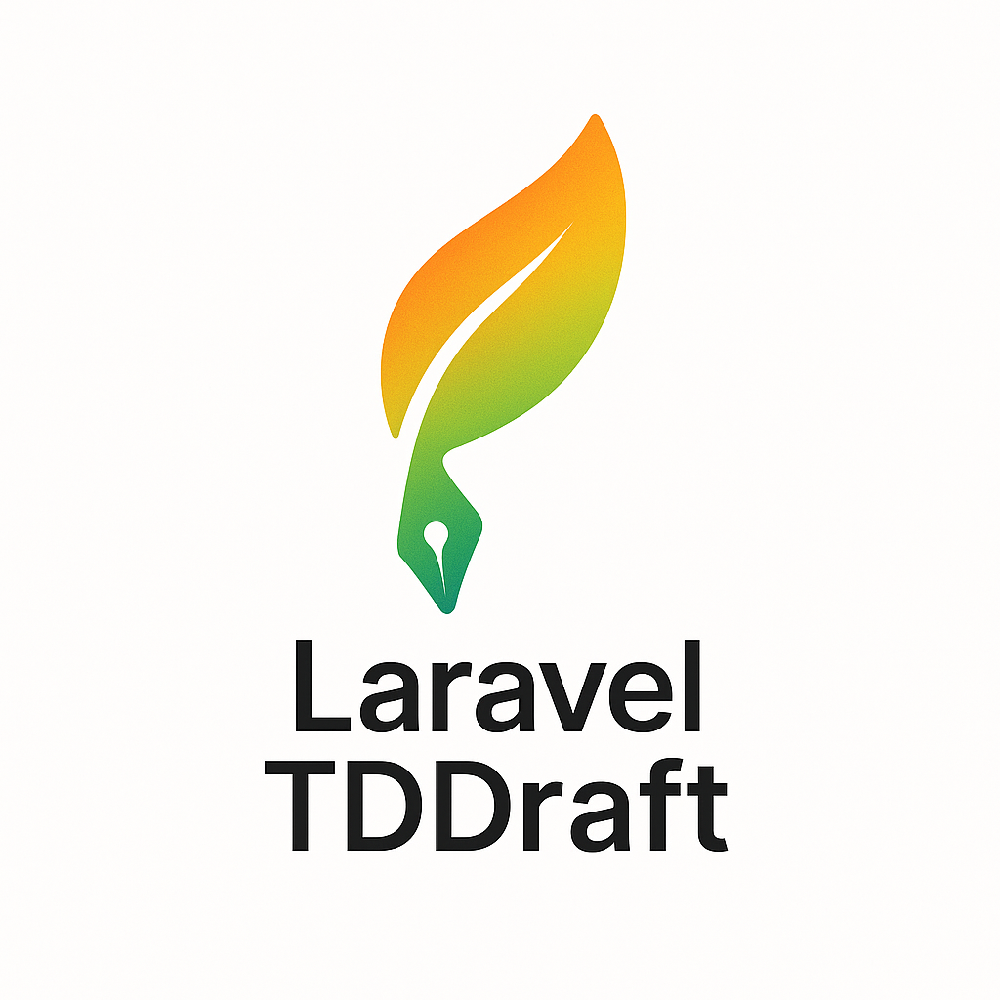

# Laravel TDDraft



> [!TIP]
> **What Laravel TDDraft does for you** — Practice real Test-Driven Development without breaking the team build: write red draft tests in an isolated suite, promote them to the real test suite once they pass, and track their status along the way.
>
> **This package is free and maintained on my own time.** If it saves you hours, a small contribution helps me keep it going:
> [💖 GitHub Sponsors](https://github.com/sponsors/Grazulex) · [☕ Buy Me a Coffee](https://buymeacoffee.com/grazulex) · [PayPal](https://paypal.me/strauven)

A Laravel package that enables safe Test-Driven Development with isolated draft testing, unique reference tracking, and powerful filtering options for professional TDD workflows.

[](https://packagist.org/packages/grazulex/laravel-tddraft)
[](https://packagist.org/packages/grazulex/laravel-tddraft)
[](https://github.com/Grazulex/laravel-tddraft/blob/main/LICENSE.md)
[](https://php.net/)
[](https://laravel.com/)
[](https://github.com/Grazulex/laravel-tddraft/actions)
[](https://github.com/laravel/pint)

## 📖 Table of Contents

- [Overview](#overview)
- [✨ Features](#-features)
- [📦 Installation](#-installation)
- [🚀 Quick Start](#-quick-start)
- [🔧 Five-Command TDD Workflow](#-five-command-tdd-workflow)
- [🔍 Filter and Group Options](#-filter-and-group-options)
- [📚 Documentation](#-documentation)
- [💡 Examples](#-examples)
- [🧪 Testing](#-testing)
- [🔧 Requirements](#-requirements)
- [🤝 Contributing](#-contributing)
- [🔒 Security](#-security)
- [📄 License](#-license)

## Overview

Laravel TDDraft enables true Test-Driven Development in Laravel applications by providing a separate, isolated testing environment where you can practice the Red-Green-Refactor cycle without affecting your CI pipeline or breaking team builds.

**The key innovation is the five-command workflow that separates experimental draft tests from production tests, with powerful filtering and status tracking to manage your TDD process professionally.**

## 🏗️ Test Architecture & Isolation

Laravel TDDraft creates a **completely separate testing environment** that doesn't interfere with your existing test suite:

```
tests/
├── Feature/           # 🟢 Your production CI tests (unchanged)
├── Unit/             # 🟢 Your production CI tests (unchanged)  
└── TDDraft/          # 🔵 Isolated draft tests (new - never affects CI)
    ├── Feature/      # Draft feature tests
    ├── Unit/         # Draft unit tests
    └── .status.json  # Status tracking (auto-generated)
```

### Key Architectural Benefits:

- **🚫 Zero CI Interference**: TDDraft tests in `tests/TDDraft/` are **completely excluded** from your main test suites
- **🔄 Independent Operation**: Your existing `tests/Unit/` and `tests/Feature/` continue working exactly as before
- **📋 Separate Test Suites**: PHPUnit/Pest configuration keeps TDDraft isolated via test suite definitions
- **⚡ Parallel Development**: Teams can practice TDD in the draft environment while CI runs production tests

### How Isolation Works:

**Standard PHPUnit/Pest Configuration:**
```xml
<testsuites>
    <testsuite name="Unit">
        <directory suffix="Test.php">tests/Unit</directory>      <!-- Production tests -->
    </testsuite>
    <testsuite name="Feature">
        <directory suffix="Test.php">tests/Feature</directory>   <!-- Production tests -->
    </testsuite>
    <!-- tests/TDDraft/ is intentionally NOT included -->
</testsuites>
```

**TDDraft Tests Run Separately:**
```bash
# Your CI pipeline (unchanged)
pest                          # Runs only tests/Unit + tests/Feature
phpunit                       # Runs only tests/Unit + tests/Feature

# TDDraft workflow (isolated)
php artisan tdd:test         # Runs only tests/TDDraft/**
pest --testsuite=tddraft     # Alternative access to draft tests
```

This architectural separation ensures that **failing TDDraft tests never break your CI builds** while you practice the Red-Green-Refactor cycle.

### 🎯 Why Laravel TDDraft?

**TDD is hard to practice in real projects because:**
- Writing failing tests breaks CI builds and affects the team
- Experimental tests clutter your main test suite
- There's no easy way to track test evolution during TDD cycles
- Promoting draft tests to production requires manual work

**Laravel TDDraft solves these problems with:**
- ✅ **Isolated Draft Testing** - Separate test environment that never affects CI
- ✅ **Unique Reference Tracking** - Every test gets a trackable ID for evolution monitoring
- ✅ **Powerful Filtering** - Advanced options to filter tests by type, path, status, and reference
- ✅ **Status Tracking** - Automatic monitoring of test results and history
- ✅ **Automated Promotion** - Easy graduation from draft to production tests
- ✅ **Professional Workflow** - Structured five-command process for TDD adoption

## ✨ Features

- 🏗️ **Complete Test Isolation** - `tests/TDDraft/` directory completely separate from `tests/Unit/` and `tests/Feature/` - never affects CI
- 🔖 **Unique Reference Tracking** - Every test gets a `tdd-YYYYMMDDHHMMSS-RANDOM` ID for precise tracking
- 🔍 **Advanced Filtering** - Filter tests by type, path, reference, status, and more
- 📊 **Automatic Status Tracking** - Monitor test results and history during TDD cycles
- 🎯 **Professional Test Management** - List, filter, and manage draft tests with detailed views
- 🚀 **Automated Promotion** - Graduate mature tests to CI suite with preserved audit trails
- 🔄 **True TDD Workflow** - Safe Red-Green-Refactor cycles without breaking builds
- 📋 **Group-Based Organization** - Pest groups for flexible test filtering and execution
- ⚡ **Five-Command Simplicity** - Complete TDD workflow with just five intuitive commands
- 🧪 **Zero Interference Design** - Your existing Unit/Feature tests continue working unchanged

## 📦 Installation

Install the package via Composer:

```bash
composer require grazulex/laravel-tddraft --dev
```

> **💡 Auto-Discovery**  
> The service provider will be automatically registered thanks to Laravel's package auto-discovery.

Publish configuration:

```bash
php artisan vendor:publish --tag=tddraft-config
```

## 🚀 Quick Start

### 1. Initialize TDDraft Environment

```bash
php artisan tdd:init
```

This sets up the isolated draft testing environment with PHPUnit/Pest configuration.

### 2. Create Your First Draft Test

```bash
php artisan tdd:make "User can register"
```

Creates a draft test with unique reference tracking:
```php
/**
 * TDDraft Test: User can register
 * Reference: tdd-20250727142530-Abc123
 * Type: feature
 */

it('user can register', function (): void {
    // TODO: Implement your test scenario here
    expect(true)->toBeTrue('Replace this with your actual test implementation');
})
->group('tddraft', 'feature', 'tdd-20250727142530-Abc123');
```

### 3. Run Draft Tests with Filtering

```bash
# Run all draft tests
php artisan tdd:test

# Filter by test name
php artisan tdd:test --filter="user registration"

# Run with coverage
php artisan tdd:test --coverage
```

### 4. Manage Tests with Advanced Filtering

```bash
# List all draft tests
php artisan tdd:list

# Filter by type
php artisan tdd:list --type=feature

# Filter by path
php artisan tdd:list --path=Auth

# Show detailed view with status information
php artisan tdd:list --details
```

### 5. Promote Mature Tests to CI Suite

```bash
# Find reference from listing
php artisan tdd:list

# Promote specific test
php artisan tdd:promote tdd-20250727142530-Abc123
```

## 🔧 Five-Command TDD Workflow

Laravel TDDraft is built around a structured five-command workflow that enables professional TDD practice:

### 1. `tdd:init` - Setup Phase
```bash
php artisan tdd:init
```
- Creates `tests/TDDraft/` directory structure
- Configures PHPUnit/Pest for isolated draft testing
- Sets up status tracking system

### 2. `tdd:make` - Red Phase (Create Failing Tests)
```bash
php artisan tdd:make "Feature description" [options]
```
**Options:**
- `--type=feature|unit` - Specify test type (default: feature)
- `--path=Auth/Api` - Custom subdirectory path
- `--class=CustomTestName` - Custom class name

Creates draft test with unique tracking reference.

### 3. `tdd:test` - Green Phase (Run and Iterate)
```bash
php artisan tdd:test [options]
```
**Options:**
- `--filter="test name"` - Filter tests by name pattern
- `--coverage` - Generate coverage report
- `--parallel` - Run tests in parallel
- `--stop-on-failure` - Stop on first failure

Runs draft tests with automatic status tracking.

### 4. `tdd:list` - Review Phase (Manage Tests)
```bash
php artisan tdd:list [options]
```
**Options:**
- `--type=feature|unit` - Filter by test type
- `--path=directory` - Filter by directory path
- `--details` - Show detailed view with status history

View and filter all draft tests with their current status.

### 5. `tdd:promote` - Graduation Phase (Move to CI)
```bash
php artisan tdd:promote <reference> [options]
```
**Options:**
- `--target=Feature|Unit` - Target directory override
- `--new-file=TestName` - Custom file name
- `--class=ClassName` - Custom class name
- `--keep-draft` - Keep original draft file
- `--force` - Overwrite without confirmation

Promotes mature tests to main test suite with audit trail preservation.

## 🔍 Filter and Group Options

Laravel TDDraft provides powerful filtering capabilities across all commands:

### Command-Specific Filters

#### `tdd:list` Command Filters
```bash
# Filter by test type
php artisan tdd:list --type=feature
php artisan tdd:list --type=unit

# Filter by directory path
php artisan tdd:list --path=Auth
php artisan tdd:list --path=Api/V1

# Show detailed view with status history
php artisan tdd:list --details

# Combine filters
php artisan tdd:list --type=feature --path=Auth --details
```

#### `tdd:test` Command Filters
```bash
# Filter by test name pattern
php artisan tdd:test --filter="user registration"
php artisan tdd:test --filter="login"

# Filter by specific reference
php artisan tdd:test --filter="tdd-20250727142530-Abc123"

# Run with additional options
php artisan tdd:test --filter="api" --coverage --parallel
```

### Pest Group System

Every draft test is automatically tagged with multiple groups for flexible filtering:

```php
it('user can register', function (): void {
    // Test implementation
})
->group('tddraft', 'feature', 'tdd-20250727142530-Abc123');
```

#### Group Types:
- **`tddraft`** - Identifies all TDDraft tests
- **`feature`/`unit`** - Test type classification
- **`tdd-YYYYMMDDHHMMSS-RANDOM`** - Unique reference for individual test tracking

#### Direct Pest Filtering:
```bash
# Run only draft tests (all)
pest --testsuite=tddraft

# Run only feature draft tests
pest --testsuite=tddraft --group=feature

# Run only unit draft tests
pest --testsuite=tddraft --group=unit

# Run specific test by reference
pest --testsuite=tddraft --group=tdd-20250727142530-Abc123

# Run multiple groups
pest --testsuite=tddraft --group=feature,unit
```

### Status-Based Management

Use the status tracking system to filter by test stability:

```bash
# List tests and check their status
php artisan tdd:list --details

# Example output shows status information:
# 📊 ✅ Passed   - Ready for promotion
# 📊 ❌ Failed   - Needs attention
# 📊 ⏭️ Skipped  - Review implementation
# 📊 🎯 Promoted - Already moved to CI
```

### Reference-Based Operations

Each test gets a unique reference for precise operations:

```bash
# Create test (generates reference)
php artisan tdd:make "User login validation"
# Output: Reference: tdd-20250727142530-Abc123

# Run specific test by reference
php artisan tdd:test --filter="tdd-20250727142530-Abc123"

# Promote specific test
php artisan tdd:promote tdd-20250727142530-Abc123

# List to find references
php artisan tdd:list | grep "tdd-"
```

### Advanced Filtering Examples

```bash
# Find all authentication-related tests
php artisan tdd:list --path=Auth --details

# Run only feature tests for API
php artisan tdd:test --filter="api" 
pest --testsuite=tddraft --group=feature | grep -i api

# Batch operations on specific test types
php artisan tdd:list --type=unit | grep "✅ Passed"  # Find unit tests ready for promotion

# Status tracking analysis
php artisan tdd:list --details | grep "❌ Failed"   # Find tests needing attention
```

## 📚 Documentation

For detailed documentation, examples, and advanced usage, please visit our comprehensive wiki:

**🌟 [Complete Documentation & Examples Wiki](https://github.com/Grazulex/laravel-tddraft/wiki)**

### Quick Links:
- � [Full Documentation](https://github.com/Grazulex/laravel-tddraft/wiki)
- 🚀 [Quick Start Guide](https://github.com/Grazulex/laravel-tddraft/wiki/Quick-Start)
- 🔧 [Configuration](https://github.com/Grazulex/laravel-tddraft/wiki/Configuration)
- 💡 [Advanced Examples](https://github.com/Grazulex/laravel-tddraft/wiki/Examples)
- 🎯 [Best Practices](https://github.com/Grazulex/laravel-tddraft/wiki/Best-Practices)
- 🧪 [Test Templates](https://github.com/Grazulex/laravel-tddraft/wiki/Templates)
- 📊 [Coverage & Reporting](https://github.com/Grazulex/laravel-tddraft/wiki/Coverage)

## 💡 Examples

### Basic TDD Workflow

```bash
# 1. Setup (one-time)
php artisan tdd:init

# 2. Create failing test (Red phase)
php artisan tdd:make "User can register with valid email"

# 3. Run tests and implement code (Green phase)
php artisan tdd:test --filter="register"

# 4. List and manage your tests
php artisan tdd:list --details

# 5. Promote stable tests to CI
php artisan tdd:promote tdd-20250727142530-Abc123
```

### Advanced Usage

For comprehensive examples including:
- **Real-world TDD workflows**
- **Advanced filtering techniques**
- **Team collaboration patterns**
- **Integration with CI/CD**
- **Performance optimization**

**👉 Visit our [Examples Wiki](https://github.com/Grazulex/laravel-tddraft/wiki/Examples)**

## 🧪 Testing

Laravel TDDraft follows its own philosophy - all tests are organized using the TDD workflow with **complete isolation between test environments**:

### Test Architecture

```
tests/
├── Feature/           # Package's production tests (for CI)
├── Unit/             # Package's production tests (for CI)
└── TDDraft/          # Draft tests (isolated, never affects CI)
```

### Running Tests

```bash
# Install dependencies
composer install

# Run the main CI test suite (production tests only)
pest                  # Runs tests/Unit + tests/Feature
pest --coverage       # With coverage for production tests

# Run specific production test groups
pest --group=unit     # Unit tests only
pest --group=feature  # Feature tests only

# TDDraft workflow (completely separate)
php artisan tdd:test  # Runs only tests/TDDraft/** tests
php artisan tdd:list  # Manage draft tests
```

### Test Isolation Benefits

**For Package Development:**
- Production tests (`tests/Unit/`, `tests/Feature/`) ensure package stability
- CI pipeline only runs production tests - never broken by experimental code
- Draft tests demonstrate package capabilities without affecting main suite

**For Package Users:**
- Your existing `tests/Unit/` and `tests/Feature/` remain unchanged
- TDDraft adds `tests/TDDraft/` for safe TDD practice
- No interference between production and draft test environments

### Writing Tests for This Package

If you're contributing to Laravel TDDraft itself, follow the same TDD principles:

1. Write failing tests first
2. Implement minimal code to make them pass  
3. Refactor while keeping tests green

The package tests itself using the standard Laravel/Pest approach, while providing TDDraft workflow for users.

## 🔧 Requirements

- **PHP**: ^8.3
- **Laravel**: ^12.0 or ^13.0
- **Pest**: ^3.0 or ^4.0 (for testing framework)

### Optional Dependencies

- **PHPUnit**: ^11.0 or ^12.0 (alternative to Pest)
- **Docker**: For containerized development (optional)

## 🤝 Contributing

We welcome contributions! Please see our [Contributing Guide](CONTRIBUTING.md) for details.

## 🔒 Security

If you discover a security vulnerability, please review our [Security Policy](SECURITY.md) before disclosing it.

## 💖 Support This Package

Laravel TDDraft is free, open source and maintained on my own time. If it saves you hours, here is how you can give back:

- ⭐ **Star the repository** — it helps other developers find it
- 🐦 **Share it** with your team and network
- 💖 **[Sponsor on GitHub](https://github.com/sponsors/Grazulex)**, **[buy me a coffee](https://buymeacoffee.com/grazulex)** or **[donate via PayPal](https://paypal.me/strauven)** — every contribution funds maintenance, new features and Laravel upgrades

## 📄 License

Laravel TDDraft is open-sourced software licensed under the [MIT license](LICENSE.md).

---

**Made with ❤️ for the Laravel community**

### Resources

- [📖 Documentation Wiki](https://github.com/Grazulex/laravel-tddraft/wiki)
- [💬 Discussions](https://github.com/Grazulex/laravel-tddraft/discussions)
- [🐛 Issue Tracker](https://github.com/Grazulex/laravel-tddraft/issues)
- [📦 Packagist](https://packagist.org/packages/grazulex/laravel-tddraft)

### Community Links

- [CODE_OF_CONDUCT.md](CODE_OF_CONDUCT.md) - Our code of conduct
- [CONTRIBUTING.md](CONTRIBUTING.md) - How to contribute
- [SECURITY.md](SECURITY.md) - Security policy
- [RELEASES.md](RELEASES.md) - Release notes and changelog
